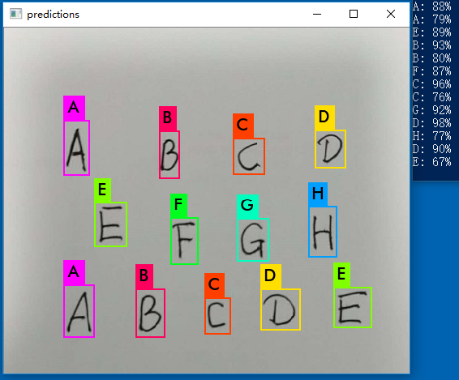
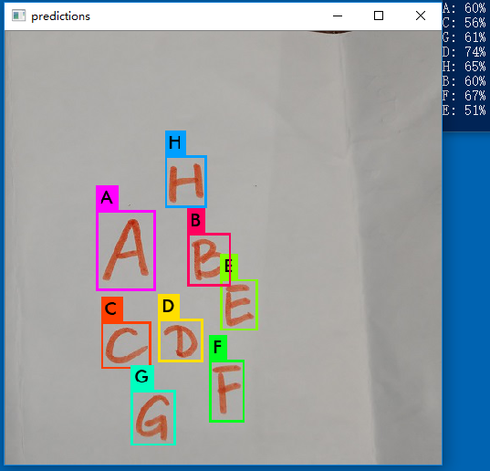

# YOLO-HWCR，基于darknet框架的端到端英文手写字符识别方案


## 一、项目背景说明
本项目为一课堂交互系统的子模块，要求通过拍照识别学生用笔手写在便利贴上的选择题答案，便利贴有各种各样的颜色，学生的笔也可能是色彩多样的，相机质量和照明的强弱变化也非常大，在功能上线之前没有可用于训练模型的数据，因此项目的挑战在于输入数据的分布范围广，又无历史数据可用，还要求第一版功能上线就能满足基本的应用需求。下图是一个测试样本：


项目要成功，第一必须解决数据的问题，开源数据集是明智的选择，但并无与本项目应用场景相同的数据集可用，所以必须通过合成的方式生成数据。第二个要解决的问题是模型的选择，直接的思维是第一步使用经典算法切割字符，第二步使用在MNIST数据集上表现优秀的模型训练后做inference。然而使用经典算法切割字符，算法设计、编码、优化、测试成本较大，举一个例子，比如说背景色和前景色颜色不同，人眼能有效识别，但转成灰度图像后可能背景亮度和前景亮度相差就很小，那么就要求经典算法在彩色空间而不仅仅是灰度空间进行字符切割，想想都啰嗦。另外的选择就是采用端到端的方案，定位和识别一步解决，You Only Look Once 又闪亮登场了！不过端到端的方案要求训练集的数据分布足够广、数据量足够大，挑战也不小。本方案由于开发资源受限，决定斗胆采用端到端方案。

## 二、数据准备
使用google花了半天时间搜索各种开源数据集，最后选定了https://www.nist.gov/srd/nist-special-database-19 提供的手写英文字符与数字数据集（MNIST数据集也是基于这个网站提供的数据集改造的），数据文件的下载链接为https://s3.amazonaws.com/nist-srd/SD19/by_class.zip ，zip解压后能看到ASCII HEX编码的目录：


每个目录下为切割好的黑白二值图像，进入目录“41”（大写字符“A”的ASCII HEX编码为41）是这样的：


整个数据集有1,546,357个文件共939MB，应该够用了，感谢互联网！

原始数据有了，接下来就基于原始数据合成用于训练模型的训练集和验证集，具体方案如下：
1. 生成512*512的彩色背景，背景颜色从HSV色彩空间按正态分布取样；
2. 从nist的原始目录随机取样一个字符，去掉白边，将二值图像反色，作为mask；
3. 生成与mask同尺寸的前景色色块，同样在HSV色彩空间中按正态分布取样；
4. 前景色色块与mask相乘得到彩色字符，在背景图中选择一个随机坐标，将彩色字符以透明的方式叠加到背景图上，每个背景图上的字符个数随机；
5. 使用高斯低通滤波对步骤4的图像进行滤波，滤波系数随机，模拟足够清晰和足够模糊的情况；
6. 一个大循环，生成N个样本，同时在步骤4中同步生成darknet所需的格式的label。

所有随机量包括：背景色的均值和方差、前景色的均值和方差、字符、字符位置、字符个数、清晰度等等（未加旋转和缩放，留待进一步优化），生成的样本还足以以假乱真，贴几个看看：


与实际的手写样本相比，生成的样本明显笔画偏粗，期待模型的泛化能力！样本的生成使用了numpy库和PIL库的无敌组合，不到200行代码搞定，调用hwcr_render.gen_trainset_validset()即可生成5000个样本的训练集和200个样本的验证集，想要更多样本直接改参数，读python代码就跟读注释一样一样的。


## 三、模型训练与测试
考虑到inference的实时需求，选用yolov3-tiny模型，为了提高模型的收敛速度以及训练完成后的inference性能，先选择合适的anchor box，执行命令：
```
darknet detector calc_anchors data/obj.data -num_of_clusters 3 -width 512 -height 512
```
计算anchor box，num_of_clusters从3到8，查看IOU的变化，最终选定num_of_clusters=5，最后两个大的anchor box分给中间层的yolo输出层，前三个小的anchor box分配给最末端的yolo输出层。
```
anchors = 38.9378,39.8249, 51.3644,54.0290, 53.4828,74.3291, 71.5426,64.8884, 81.7291,90.0927
```

一切准备就绪，开始training，然而训练了8000多个epoch，发现模型收敛的不够理想，无论是训练集还是验证集字符的识别率（分类准确率）都很低，loss曲线也早早就横盘了。反复分析traning log，最后发现问题出在IOU，平均IOU只能到80%（定位精度是YOLO的一大缺陷，尤其是小目标的定位精度），而训练样本中字符的box是仅贴着字符框注的，没留白边，如果IOU不到100%字符必定会被切边，“E”的下边被切不就成“F”了么？回想起谷歌街景团队识别门牌号码也曾经踩过这个坑。知道问题原因就好办了，既然IOU只能收敛到80%，那么就按80%的IOU反推字符所需的白边，几行python一改新的数据集就生成好了（这要是用人返工工打标签，后果不敢想。。。）。


使用64的mini-batch size，0.001的learning rate，先冻结住输入层之后的7层CNN层（为什么是7层而不是8层、6层？ 这是深度学习让人最恼火的地方！），训练8000个epoch，发现loss横盘了，把learning rate降低到0.0001再训练1000个epoch，loss又横盘，测试之后发现相比给字符加白框前各项性能有显著提升，但在测试数据上的泛化不够理想（测试数据的笔画比较细），于是放开先前冻结住的头7层CNN，再训练10000个epoch，在9000到12000个epoch之前loss曲线很喜人，到了15000个epoch之后又loss曲线又盘了，终止训练，loss曲线如下图所示：


训练终止时的log输出：
```
Region 16 Avg IOU: 0.906806, Class: 0.983892, Obj: 0.566550, No Obj: 0.003308, .5R: 1.000000, .75R: 1.000000,  count: 10
Region 23 Avg IOU: 0.812808, Class: 0.820853, Obj: 0.441440, No Obj: 0.001539, .5R: 0.888889, .75R: 0.722222,  count: 18
Region 16 Avg IOU: 0.799825, Class: 0.810016, Obj: 0.413300, No Obj: 0.002858, .5R: 1.000000, .75R: 0.666667,  count: 6
Region 23 Avg IOU: 0.877360, Class: 0.762482, Obj: 0.502397, No Obj: 0.001608, .5R: 1.000000, .75R: 0.952381,  count: 21
Region 16 Avg IOU: 0.925516, Class: 0.999077, Obj: 0.516828, No Obj: 0.002808, .5R: 1.000000, .75R: 1.000000,  count: 7
Region 23 Avg IOU: 0.881721, Class: 0.959953, Obj: 0.713188, No Obj: 0.002278, .5R: 1.000000, .75R: 0.979167,  count: 48
Region 16 Avg IOU: 0.907426, Class: 0.991686, Obj: 0.459764, No Obj: 0.003427, .5R: 1.000000, .75R: 1.000000,  count: 15
Region 23 Avg IOU: 0.881886, Class: 0.948699, Obj: 0.732364, No Obj: 0.002093, .5R: 0.976190, .75R: 0.952381,  count: 42
Region 16 Avg IOU: 0.903708, Class: 0.991701, Obj: 0.613804, No Obj: 0.004213, .5R: 1.000000, .75R: 0.909091,  count: 11
Region 23 Avg IOU: 0.889392, Class: 0.862185, Obj: 0.628018, No Obj: 0.002551, .5R: 1.000000, .75R: 1.000000,  count: 38
Region 16 Avg IOU: 0.883676, Class: 0.868179, Obj: 0.365485, No Obj: 0.003536, .5R: 1.000000, .75R: 0.947368,  count: 19
Region 23 Avg IOU: 0.806226, Class: 0.848917, Obj: 0.397804, No Obj: 0.000856, .5R: 0.888889, .75R: 0.777778,  count: 18
Region 16 Avg IOU: 0.888255, Class: 0.995563, Obj: 0.527044, No Obj: 0.002831, .5R: 1.000000, .75R: 1.000000,  count: 8
Region 23 Avg IOU: 0.859816, Class: 0.891239, Obj: 0.655900, No Obj: 0.002254, .5R: 0.962963, .75R: 0.925926,  count: 27
Region 16 Avg IOU: 0.899839, Class: 0.962639, Obj: 0.428383, No Obj: 0.002739, .5R: 1.000000, .75R: 1.000000,  count: 9
Region 23 Avg IOU: 0.890829, Class: 0.883188, Obj: 0.505143, No Obj: 0.001650, .5R: 1.000000, .75R: 0.911765,  count: 34
Region 16 Avg IOU: 0.904544, Class: 0.994570, Obj: 0.532469, No Obj: 0.003953, .5R: 1.000000, .75R: 1.000000,  count: 9
Region 23 Avg IOU: 0.895041, Class: 0.932958, Obj: 0.675852, No Obj: 0.001945, .5R: 1.000000, .75R: 1.000000,  count: 34
Region 16 Avg IOU: 0.906387, Class: 0.981745, Obj: 0.537764, No Obj: 0.003257, .5R: 1.000000, .75R: 1.000000,  count: 10
Region 23 Avg IOU: 0.914320, Class: 0.974316, Obj: 0.723495, No Obj: 0.002527, .5R: 1.000000, .75R: 0.979167,  count: 48
Region 16 Avg IOU: 0.903735, Class: 0.939980, Obj: 0.354493, No Obj: 0.002394, .5R: 1.000000, .75R: 1.000000,  count: 12
Region 23 Avg IOU: 0.799927, Class: 0.676160, Obj: 0.350774, No Obj: 0.001130, .5R: 0.944444, .75R: 0.666667,  count: 18
Region 16 Avg IOU: 0.911366, Class: 0.994748, Obj: 0.503454, No Obj: 0.004224, .5R: 1.000000, .75R: 1.000000,  count: 8
Region 23 Avg IOU: 0.867616, Class: 0.926974, Obj: 0.721414, No Obj: 0.001968, .5R: 0.961538, .75R: 0.961538,  count: 26
Region 16 Avg IOU: 0.902582, Class: 0.998731, Obj: 0.460500, No Obj: 0.002714, .5R: 1.000000, .75R: 1.000000,  count: 7
Region 23 Avg IOU: 0.812056, Class: 0.793621, Obj: 0.505372, No Obj: 0.001146, .5R: 0.920000, .75R: 0.880000,  count: 25
Region 16 Avg IOU: 0.834405, Class: 0.999233, Obj: 0.594566, No Obj: 0.004135, .5R: 1.000000, .75R: 0.900000,  count: 10
Region 23 Avg IOU: 0.870805, Class: 0.911929, Obj: 0.527696, No Obj: 0.001790, .5R: 0.966667, .75R: 0.933333,  count: 30
Region 16 Avg IOU: 0.881087, Class: 0.992448, Obj: 0.466718, No Obj: 0.004566, .5R: 1.000000, .75R: 0.904762,  count: 21
Region 23 Avg IOU: 0.883137, Class: 0.878357, Obj: 0.631663, No Obj: 0.001755, .5R: 1.000000, .75R: 0.953488,  count: 43
Region 16 Avg IOU: 0.897574, Class: 0.986940, Obj: 0.435218, No Obj: 0.003256, .5R: 1.000000, .75R: 1.000000,  count: 7
Region 23 Avg IOU: 0.876983, Class: 0.888610, Obj: 0.538029, No Obj: 0.001378, .5R: 1.000000, .75R: 0.888889,  count: 36

15700: 1.890148, 1.869278 avg loss, 0.00100 rate, 4.366384 seconds, 2009600 images
```

## 看看验证集的inference效果如何：


## 再看看测试数据的inference效果如何：





看来模型的泛化能力似乎不错，粗细笔画都认得，白底黑字对象的置信率最高，整体性能达到第一个版本的使用要求！
